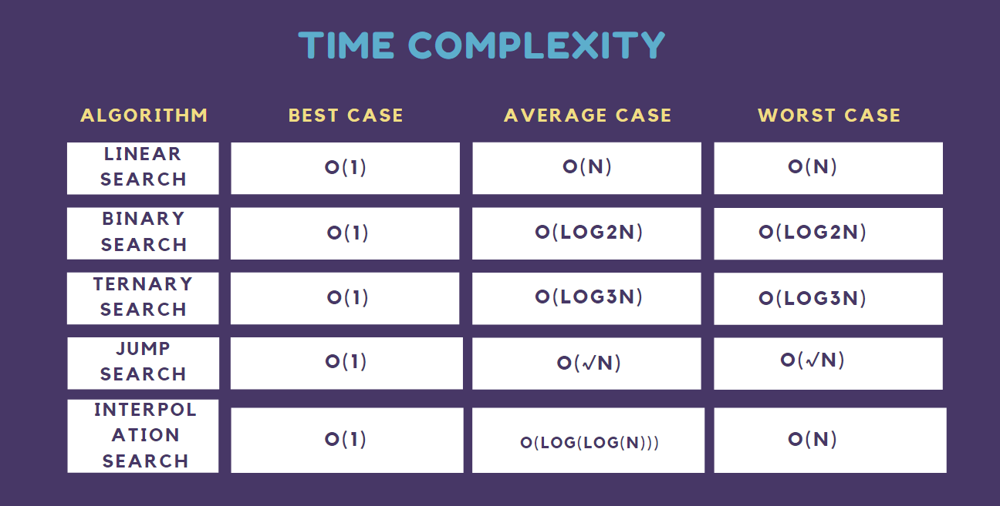

# Search Algorithms

Searching Algorithms are designed to check for an element or retrieve an element from any data structure where it is stored.

<p align="center"></p>

## Directory Files:
* [0-linear.c](0-linear.c) - implementation of linear search
* [1-binary.c](1-binary.c) - implementation of binary search
* [search_algos.h](search_algos.h) - header files for all the functions in the directory
* [mains](mains) - contains main methods to test questions
* [output](output) - directory that contains all the executable tests for mains
* [2-O](2-O) - the time complexity (worst case) of a linear search in an array of size n
* [3-O](3-O) - the space complexity (worst case) of an iterative linear search algorithm in an array of size n
* [4-O](4-O) - the time complexity (worst case) of a binary search in an array of size n
* [5-O](5-O) - the space complexity (worst case) of a binary search in an array of size n
* [6-O](6-O) - the space complexity of this function / algorithm
  * ```C
    int **allocate_map(int n, int m)
    {
        int **map;

        map = malloc(sizeof(int *) * n);
        for (size_t i = 0; i < n; i++)
        {
             map[i] = malloc(sizeof(int) * m);
        }
        return (map);
    }
    ```
